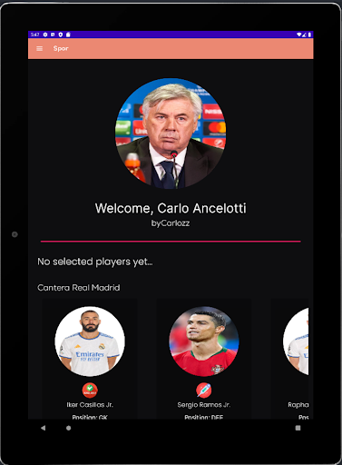

# Spor

Spor is a sports based application developed for Android devices completed as the end of degree project, with functionalities such as a digital whiteboard and video recording with video edition, based on real-time visual tracking, which has been designed and implemented as a help tool for the coach when carrying out their training sessions, providing a system that provides greater clarity and in-depth explanations to its players during training sessions, it also gathers and stores all the information related to the players so that it can later be used for analysis purposes with the aim of improving player game quality.
 
Using the application you can access features such as an interactive whiteboard, with the possibility of recording plays and/or animations and also video recording with dynamic drawings created by the user on the frame, with the insertion of different graphical elements that serve to assist in the explanation (eg spotlights , arrows, etc.), accessing these and the rest of the functionalities from a comfortable and intuitive graphical interface.

The development of a machine learning model, within the artificial vision area, specifically the conceptualization of a neural network, has been implemented as a concept with the purpose of being able to identify players taking a video as input and generating a bird's-eye view where each point corresponds to a player relative to the field. More information can be found in the following link: https://github.com/riniguez91/player-tracking-spor

The full report containing extensive detail can be found in the following link which I highly recommend looking at: https://github.com/riniguez91/Spor/blob/main/Memoria%20Spor.docx

# App screenshots

* Login

* Register

* Sessions

 

* Filter by date

* Saved plays

* Exercises

* Whiteboard

* Profile / Session Creator

* Video editor

